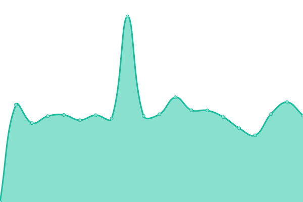
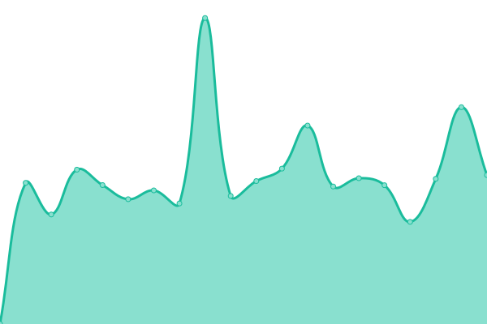
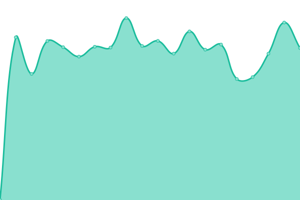

# [📈 Live Status](https://akbruster.github.io/upptime-status): <!--live status--> **🟧 Partial outage**

This repository contains the open-source uptime monitor and status page for [Manik Koirala](https://akbruster.github.io/upptime-status), powered by [Upptime](https://github.com/upptime/upptime).

With [Upptime](https://upptime.js.org), you can get your own unlimited and free uptime monitor and status page, powered entirely by a GitHub repository. We use [Issues](https://github.com/akbruster/upptime-status/issues) as incident reports, [Actions](https://github.com/akbruster/upptime-status/actions) as uptime monitors, and [Pages](https://akbruster.github.io/upptime-status) for the status page.

<!--start: status pages-->
<!-- This summary is generated by Upptime (https://github.com/upptime/upptime) -->
<!-- Do not edit this manually, your changes will be overwritten -->
<!-- prettier-ignore -->
| URL | Status | History | Response Time | Uptime |
| --- | ------ | ------- | ------------- | ------ |
|  [AG Api](https://api.ambition.guru) | 🟩 Up | [ag-api.yml](https://github.com/akbruster/upptime-status/commits/HEAD/history/ag-api.yml) | 

 1148ms
     
 | 

<a href="https://akbruster.github.io/upptime-status/history/ag-api">98.82%</a>
    

|  [AG App](https://app.ambition.guru) | 🟩 Up | [ag-app.yml](https://github.com/akbruster/upptime-status/commits/HEAD/history/ag-app.yml) | 

 1110ms
     
 | 

<a href="https://akbruster.github.io/upptime-status/history/ag-app">98.85%</a>
    

|  [AG Website](https://ambition.guru) | 🟩 Up | [ag-website.yml](https://github.com/akbruster/upptime-status/commits/HEAD/history/ag-website.yml) | 

 2295ms
     
 | 

<a href="https://akbruster.github.io/upptime-status/history/ag-website">99.02%</a>
    

|  [AG Books](https://books.ambition.guru) | 🟩 Up | [ag-books.yml](https://github.com/akbruster/upptime-status/commits/HEAD/history/ag-books.yml) | 

 2007ms
     
 | 

<a href="https://akbruster.github.io/upptime-status/history/ag-books">99.04%</a>
    

|  [IPv6 test](forwardemail.net) | 🟥 Down | [i-pv6-test.yml](https://github.com/akbruster/upptime-status/commits/HEAD/history/i-pv6-test.yml) | 

 0ms
     
 | 

<a href="https://akbruster.github.io/upptime-status/history/i-pv6-test">100.00%</a>
    

<!--end: status pages-->

[**Visit our status website →**](https://akbruster.github.io/upptime-status)

## 📄 License

- Powered by: [Upptime](https://github.com/upptime/upptime)
- Code: [MIT](./LICENSE) © [Anand Chowdhary](https://anandchowdhary.com), supported by [Pabio](https://pabio.com)
- Data in the `./history` directory: [Open Database License](https://opendatacommons.org/licenses/odbl/1-0/)
